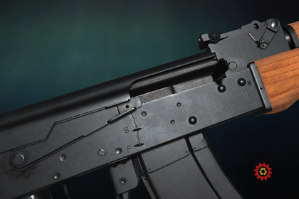
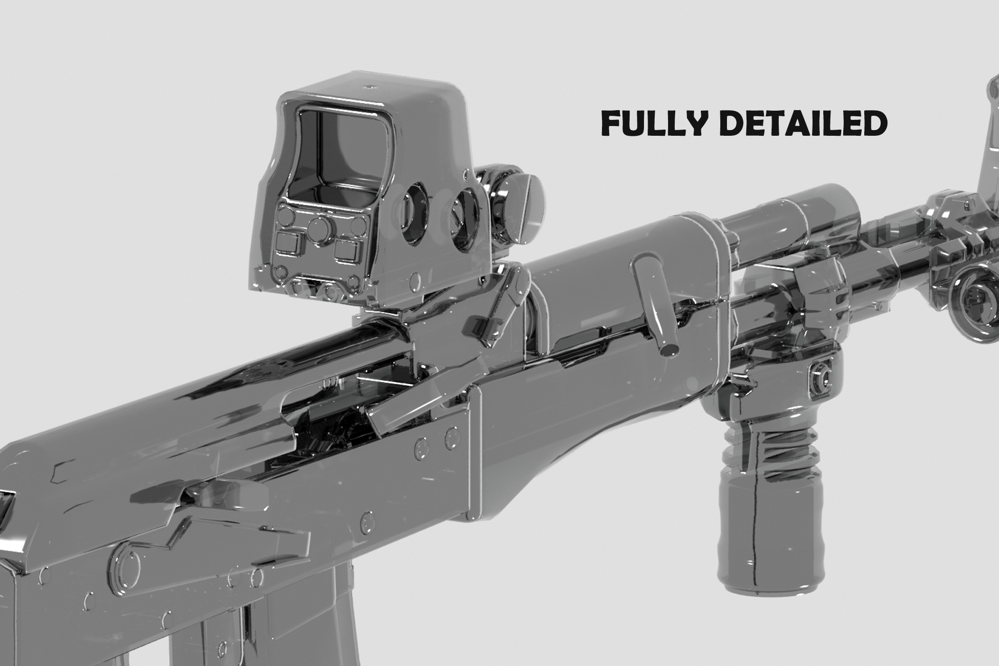
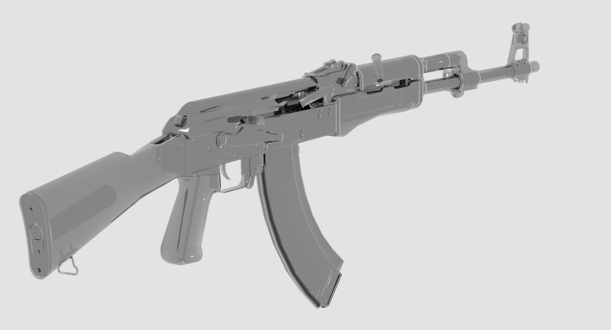
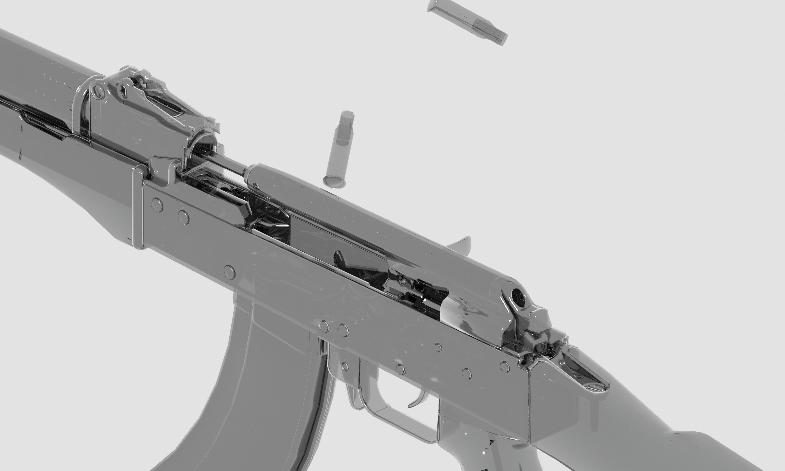

# Support

___

  

> Don't forget to leave feedback! It helps me a lot in development!

# Ak47 Fully Detailed

___

Find the asset on Unity [Asset Store](https://assetstore.unity.com/packages/slug/78123) and [Demo here](https://cloud.mail.ru/public/2KeT/2M9gTMe5x) 
[Weapon Attachments Detailed](https://assetstore.unity.com/packages/3d/props/weapons/weapon-attachments-detailed-pack-13-74445)

# About

___

Fully detailed model of the [Kalashnikov](https://assetstore.unity.com/packages/slug/78123) assault rifle with all parts. All models are low poly and ready for animation and integration into your game. All parts have original dimensions.

> All render images for attachments were made with using Corona Render! You can find more renders on my portfolio (including Unity render).

## Key Features

- Total models - 96
- The models separated
- High-quality PBR textures: 4096x4096 (the main weapon size), 2048x2048, 1024x1024 (depending on attachments)
- Textures complete - Diffuse(Albedo) map, Normal map, Metallic map (the main weapon), Specular map (attachments), AO map.
- Textures complete - Semi-Dmg, Orange-Plastic for magazine
- Low-poly models
- File complete - .fbx

## Includes

* [Flash Hider (Dark)](https://www.artstation.com/artwork/L2VDxl "https://www.artstation.com/artwork/L2VDxl")
* [Holographic Optic (1 texture set)](https://www.artstation.com/artwork/L2VARk "https://www.artstation.com/artwork/L2VARk")
* [Plank Picatinny on ironsight (1 texture set)](https://www.artstation.com/artwork/Z5Wo5w "https://www.artstation.com/artwork/Z5Wo5w")

## Gallery

# Compatibility

___

 
Compatible with the following versions of **Unity**:
- **Unity 2022.3.7f1** or higher
- **Unity 6000.0.22f1**

Supported render-pipelines:
- 
- 
- 

# Platform

___

   

# Contacts

___

     

E-mail: choco.16mail@mail.ru
My other [ASSETS](https://assetstore.unity.com/publishers/18484)

# Bug-reports

___

If you find a bug or have any suggestions for improvement, please let us know: choco.16mail@mail.ru

# Refund policy

___

If you’re uncertain about any asset’s workings or have questions before purchasing, please do not hesitate to reach out. We will do our best to answer your questions. Please read this before purchase to avoid any unwelcome surprises.

This policy attempts to clarify the [asset store EULA‘s](https://unity.com/pt/legal/as-terms) legal jargon and specifies the practical cases that it does, or does not cover. It does not add refund conditions that aren’t already covered by it.

All Asset Store sales **are final** as per the EULA section 2.2.9, which is agreed upon at checkout. Digital purchases cannot be returned once downloaded, hence it’s required to agree to waive the right to a refund. Clicking the “Download” button finalizes this agreement.

This is because it is impossible to ensure the package files are deleted after a refund is issued. Keeping both the package and its monetary value is not a fair trade. Therefore, some conditions must be met in order to avoid abuse or supporting impulsive purchases:
**Conditions that justify a refund:**
- You have not yet downloaded the asset (verified through invoice number).
- Accidental purchase, or on wrong account (only valid if not yet downloaded).
- The asset was removed from the store within 4 weeks of purchasing.
- The asset fails to work as advertised, or there is a vital incompatibility with existing systems (within the confines of the supported platforms, capabilities, and versions). And cannot be resolved in a future update or a hotfix.

**Requests are declined if:**
- The invoice date exceeds 14 days prior to the request.
- You appear to not have read, misread or misunderstood the store page description (“as advertised”), or otherwise failed to inform yourself through the linked online documentation. This includes details such as:
- Minimum/maximum compatible or supported Unity versions
- Compatible or supported platforms
- Scriptable Render Pipeline compatibility (including the built-in RP)
- Listed features and limitations
- The asset is claimed to no longer be used.
- The package in question went on sale, or an upgrade discount was introduced, shortly after a full-price purchase was made.

If you find you are in accordance with these conditions, please get in touch on the basis of your request.

# Updates

___

**3.1**
- Updated to Unity6
- Separate High-quality textures. Must be downloaded separately, link is in Readme.txt file

**3.0**
 
******ATTENTION******

Big FREE UPDATE!

I removed a lot of attachments from the Asset. If you purchased this Asset, please make a copy of the previous version of the Asset in orde to not to lose attachments!!!

You can download the Demo scene and check what was changed!

Briefly:
1) Rebuilt the model (a little)
2) Retextured the model - PBR texture in 4K resolution - you need see it!
3) Updated the demo scene

**2.1**

* Collimator Sight
	Features:
	¤ Includes Sight
	¤ Includes separated details
	¤ Textures - HQ textures 2048 
	¤ Textures - Albedo, Specular, Normal, Gloss
	¤ Textures - 3 different materials (Vol 1, Vol 2, Vol 3)
	¤ Prefabs
* Flashlight support
	Features:
	¤ Detailed
	¤ Textures - HQ textures 2048
	¤ Textures - Albedo, Specular, Normal
	¤ Textures - 2 different materials (Clean, Dmg)
	¤ Prefabs

**2.0**

Added:
* A simple controller for showing animations not more
* FPS Hands (for more information => FPS Hands => Readme.txt file)
* 17 animations
	¤ Walk 1 
	¤ Walk 2 
	¤ Idle 1 
	¤ Idle 2 
	¤ Fire 1 (one shot)
	¤ Fire 2 (two shots)
	¤ IdleWalkToRun 
	¤ Run
	¤ RunToIdleWalk
	¤ Get
	¤ Remove
	¤ AimUp
	¤ AimFire 1 (one shot)
	¤ AimFire 2 (two shots)
	¤ AimDown
	¤ Reload 1
	¤ REload 2
* Audio
	¤ Fire

Improvements:
* Updated to Unity 5

NOTES
Walk1 10 - 40
Walk2 40 - 70
Idle1 70-120
Idle2 120-235
Fire1 235-245
Fire2 245-255
IdleWalkToRun 255-265
Run 265-296
RunToIdleWalk 296-306
Get1 310-325
Remove 325-340
AimUp 360-366
AimFire1 366-376
AimFire2 376-386
AimDown 386-392
Reload 392-452
Reload2 456-545

**1.6**

Added:
* Demo Scene Updated
* FPS Pack
	Features:
	¤ Low Poly model
	¤ 1 level LOD (can be used for Ak47M1 Fully Detailed)
	¤ New textures magazine 512x512 (new model magazine) 
	¤ Prefabs
* Prefabs
	¤ Ak47M1 Tactic

**1.5**

Added:
* Flash Hider (Dark)
	Features:
	¤ Total models - 1
	¤ Detailed
	¤ Includes FPS model
	¤ Includes 1 level LOD
	¤ Textures - HQ textures 1024
	¤ Textures - Albedo, Specular, Normal, Gloss
	¤ Textures - 2 different materials (Base-CleanMetal, DmgMetalOil)
	¤ Prefabs
* Holographic Optic Eotech l3 XPS 2.0 M
	Features:
	¤ Total models - 23
	¤ Detailed
	¤ Includes FPS model
	¤ Includes Sight
	¤ Includes separated details
	¤ Models it was divided
	¤ Textures - HQ textures 2048, 1024, 512 
	¤ Textures - Albedo, Specular, Normal, Gloss
	¤ Textures - 3 different materials (Base-CleanMetal, "Zombie" style, Base-CleanMetal with Text)
	¤ Prefabs

**1.4**

Added
* Flashlight G2V3
	Features:
	¤ Total models - 13
	¤ Fully Detailed
	¤ Includes FPS model
	¤ Includes separated details
	¤ Models it was divided
	¤ Includes 1 level LOD
	¤ Textures - HQ textures 2048, 1024, 512 
	¤ Textures - Albedo, Specular, Normal
	¤ Textures - 3 different materials (Base-Clean, Metal, Metal with Text)
	¤ Textures - 3 different cookies on spotlight
	¤ Prefabs
* Picatinny FDefence
	Features:
	¤ Total models - 7
	¤ Fully Detailed
	¤ Includes separated details
	¤ Models it was divided
	¤ Models - 2 models (2 sides and 1 side)
	¤ Includes 1 level LOD
	¤ Textures - HQ textures 1024
	¤ Textures - Albedo, Specular, Normal, Gloss
	¤ Textures - 2 different materials (Base-Clean, Dmg)
	¤ Prefabs
* Picatinny OnIronsight
	Features:
	¤ Total models - 5
	¤ Fully Detailed
	¤ Includes separated details
	¤ Models it was divided
	¤ Includes 1 level LOD
	¤ Textures - HQ textures 2048
	¤ Textures - Albedo, Specular, Normal, Gloss
	¤ Textures - 4 different materials (Base-CleanV1, Base-DmgV1, Base-CleanV2, Base-DmgV2)
	¤ Prefabs
* Tactic Grip
	Features:
	¤ Total models - 4
	¤ Fully Detailed
	¤ Includes separated details
	¤ Models it was divided
	¤ Textures - HQ textures 2048
	¤ Textures - Albedo, Specular, Normal, Gloss
	¤ Textures - 2 different materials (Base-CleanPlastic, NoisePlastic)
	¤ Prefabs

**1.3**

Fixes and Improvement:
* Ak03_Receiver_cover - Fixed Mesh
* Ak03_NORMAL.png - Fixes NM
* Removed unused textures

**1.2**

Added:
* Bullet 7.62
* Magazine Full
* New textures - Army (for Ak02, Ak03, Ak10)
* Prefabs

**1.1**

Added 20 new details

Improvement and Fixes:
* Ak01_Stock
* Ak04_Rear_sight_base
* Ak04_Rear_sight_elevating_slide
* Ak08_Front_sight_base
* Ak08_Retainer_lock
* Ak11_Stock_screw 
* Ak12_Buttplate
* Ak13_Bolt_carrier
* Ak13_Gas_piston
* Ak14_Bolt
* Ak14_Recpil_spring_guide
* Ak14_Recpil_spring_strut
* Ak15_Trigger
* Ak15_Sear
* Ak15_Spacer
* Animation

Added:
* Ak11_Stock_screw 
* Ak12_Buttplate_Cover_Lower
* Ak12_Buttplate_Cover_Base
* Ak12_Battplate_cover_pin
* Ak14_Retainer
* Ak14_Extractor_Pin
* Ak16_Lock_Spring
* Ak16_Elivating_Slide_Catch_Spring
* Ak16_Magazine_Latch_Spring
* Ak16_Accessories_Spring
* Ak16_Sear_Spring
* Ak16_Extractor_Spring
* Akl7_Accessories Case
* Ak17_Accessories_Case_Cap
* Ak17_Buttplate_Cover_Lower_rivets
* Ak17_Buttplate_Screw
* Ak17_Planer
* Ak17_Temporary_Axis
* Ak17_Turn_Screw
* Ak17_Bore_Brush
* Accessories
* Material Ak17

**1.0**
- All details are numbered, each number has its own material.
- As the drawings of receipt, I will release an update.
- At the moment, there is no accessories case!!!