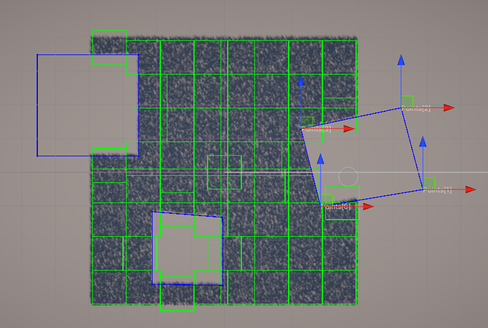

# Support

___

[](https://ko-fi.com/erochinsam) [](https://patreon.com/ErochinSam) [](https://boosty.to/erochinsam/donate)


# IIGR - InstancedIndirectGrassRenderer

___

The material from this repository was taken as a basis [UnityURP-MobileDrawMeshInstancedIndirectExample](https://github.com/ColinLeung-NiloCat/UnityURP-MobileDrawMeshInstancedIndirectExample/tree/master). More detailed information can be found there. Here I will describe the changes, innovations and improvements.

 


Find the asset on Unity [Asset Store](https://u3d.as/3uNt).

# Games

___

You can achieve this result using the IIGR asset, screenshots from the game [The Last World](https://store.steampowered.com/app/1927520/The_Last_World/)


# Before start

___

> Not supported for Unity 6 or newer!

Before launching, you need to enable Grass Render Feature in the **URP** settings:

- Go to the settings folder and select the current **URP** graphics settings, for example *Assets/Settings/URP-HighFidelity-Renderer.asset*.
- Click the **Add Render Feature** button and add **Grass Bending RT Pre Pass**

# What's new?

___

## Editor for working with grass

Added many auxiliary elements, such as:

### Grass cell rendering area


### Culling objects


### Culling objects settings


### GUI for changing the settings of the grass in real time

### Buttons for quick access to the necessary functions


## Baking the grass, hiding the grass

___

Grass generation works like this: you pass an array of points and [IIGR](https://u3d.as/3uNt) creates grass at those points. The area can be completely filled with grass and in order not to generate all the grass and not fill the computer's memory with unnecessary, unused data, a grass clipping system was introduced. You specify the area in which the grass should be clipped and then bake it.


> Make sure your herb is generated before baking!

Baking works in multi-threaded mode. Also, during baking, the main [IIGR](https://u3d.as/3uNt) functions will be unavailable. You can interrupt baking by simply turning the [IIGR](https://u3d.as/3uNt) component off and on. However, this is not recommended!

## Terrain support

___


[IIGR](https://u3d.as/3uNt) supports standard Terrain Unity. Just attach the TerrainGrass component to it and press the Preview button and watch the result. To increase the density of grass, you need to increase the resolution of the terrain in its settings. The default resolution is 1025x1025. At a lower resolution, artifacts in the form of blinking grass may appear.


## Shadows

___


In URP, shadows are controlled in the render settings. The **Cascade Count** parameter is responsible for this. Unfortunately, at higher values of this parameter, shadows from objects disappear. Keep this in mind!


## Multithreading

___

Most operations are performed in multi-threaded mode. This is done to optimize and speed up data generation.

> It is not recommended to perform time-consuming operations in real time or in the Update method!

A good practice is to first generate the grass area, then bake it and then save it to file.

## Saving and loading data

___

Saving and loading data is done from a *.dat file. The binary format was chosen to reduce the file size and increase the speed of reading and writing to it.

> If your scene has a large amount of grass, for example more than 10 million, then the save file will be large (about 200 MB). At the same time, loading the file may take a long time. Keep this in mind!


Generating 10 million blades of grass takes less than 5 seconds
Cutting three objects with 10 million blades of grass takes less than 5 seconds

## How do I add my details?

___

To add your grass data you need to pass an array of positions and heights to **InstancedIndirectGrassRenderer**:

```csharp
/// <summary>
/// Add data to grass render
/// </summary>
/// <param name="grassData">Custom data. Massives with Positions and Heights</param>
/// <param name="clearData">If true the inner grass data will be cleared</param>
public void AddRange(GrassData grassData, bool clearData = false) { ... }
```

After you add the data the grass will be recalculated and displayed on the screen.

To start baking grass you need to call the method

```csharp
internal IEnumerator BakeCullingAsync(Action callback) { ... }
```

Example call:

```csharp
StartCoroutine(InstancedIndirectGrassRenderer.Instance.BakeCullingAsync(OnBakingFinish));
```

## Dependencies

___

- [Editor Coroutines](https://docs.unity3d.com/Packages/com.unity.editorcoroutines@1.0/manual/index.html)

# Compatibility

___

 
Compatible with the following versions of **Unity**:
- **Unity 2022.3.7f1** or higher
- **Unity 6000.0.22f1**

Render-pipelines:
- 

>   not supported!

# Platform

___

  

# Contacts

___

[](https://www.facebook.com/profile.php?id=100004418195249) [](https://www.instagram.com/sam.eroch/) [](https://www.linkedin.com/in/sam-erochin-927a629b/) [](https://x.com/VooChannel) [](https://www.youtube.com/@voochannel7151)

E-mail: choco.16mail@mail.ru
My other [ASSETS](https://assetstore.unity.com/publishers/18484)

# Bug-reports

___

If you find a bug or have any suggestions for improvement, please let us know: choco.16mail@mail.ru


# Refund policy

If you’re uncertain about any asset’s workings or have questions before purchasing, please do not hesitate to reach out. We will do our best to answer your questions. Please read this before purchase to avoid any unwelcome surprises.

This policy attempts to clarify the [asset store EULA‘s](https://unity.com/pt/legal/as-terms) legal jargon and specifies the practical cases that it does, or does not cover. It does not add refund conditions that aren’t already covered by it.

All Asset Store sales **are final** as per the EULA section 2.2.9, which is agreed upon at checkout. Digital purchases cannot be returned once downloaded, hence it’s required to agree to waive the right to a refund. Clicking the “Download” button finalizes this agreement.

This is because it is impossible to ensure the package files are deleted after a refund is issued. Keeping both the package and its monetary value is not a fair trade. Therefore, some conditions must be met in order to avoid abuse or supporting impulsive purchases:
**Conditions that justify a refund:**
- You have not yet downloaded the asset (verified through invoice number).
- Accidental purchase, or on wrong account (only valid if not yet downloaded).
- The asset was removed from the store within 4 weeks of purchasing.
- The asset fails to work as advertised, or there is a vital incompatibility with existing systems (within the confines of the supported platforms, capabilities, and versions). And cannot be resolved in a future update or a hotfix.

**Requests are declined if:**
- The invoice date exceeds 14 days prior to the request.
- You appear to not have read, misread or misunderstood the store page description (“as advertised”), or otherwise failed to inform yourself through the linked online documentation. This includes details such as:
- Minimum/maximum compatible or supported Unity versions
- Compatible or supported platforms
- Scriptable Render Pipeline compatibility (including the built-in RP)
- Listed features and limitations
- The asset is claimed to no longer be used.
- The package in question went on sale, or an upgrade discount was introduced, shortly after a full-price purchase was made.

If you find you are in accordance with these conditions, please get in touch on the basis of your request.

# References

___

- [UnityURP-MobileDrawMeshInstancedIndirectExample](https://github.com/ColinLeung-NiloCat/UnityURP-MobileDrawMeshInstancedIndirectExample/tree/master)