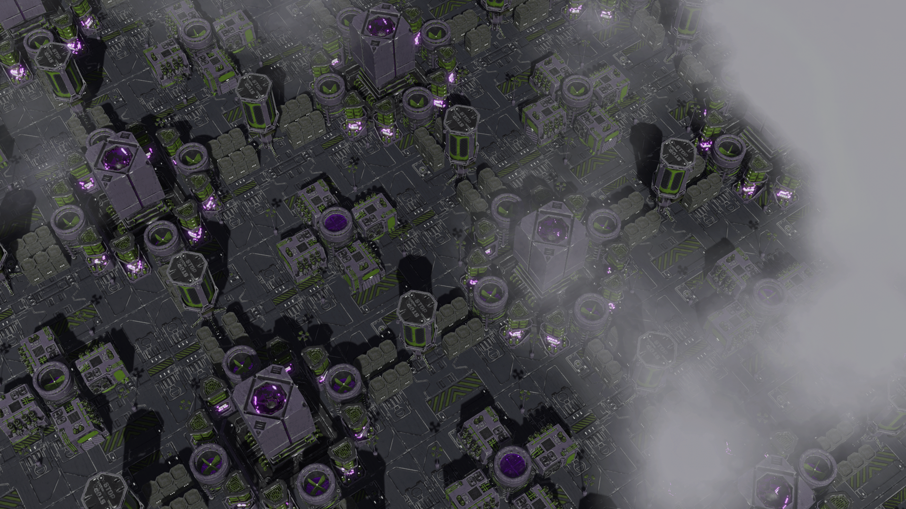
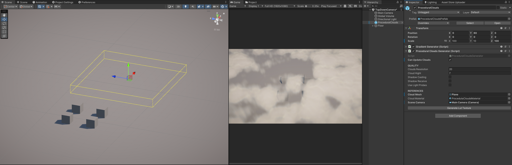
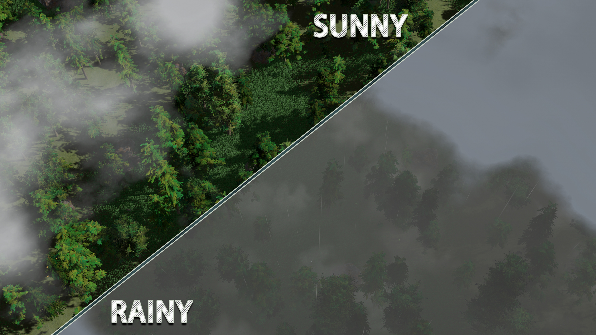
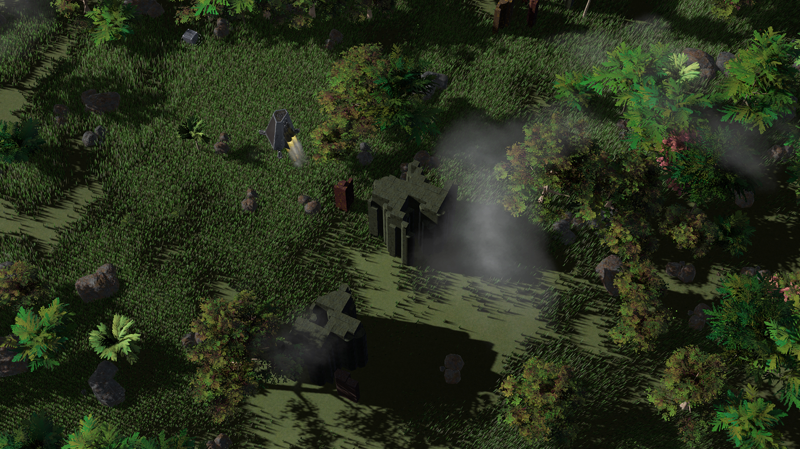

# Support

___

  

# Procedural Clouds

___

Procedural generation of clouds using a shader.

 

Find the asset on Unity [Asset Store]().

# About

___

The asset is built using Visual Shader Graph.

> Clouds are only rendered in the Game window!

Top down clouds

First persone clouds

## Games

___

Games that use the same technology:
- [The Last World](https://store.steampowered.com/app/1927520/The_Last_World/)

What you can achieve using Procedural Clouds.

## Dependencies

___

- Visual Shader Graph

# Compatibility

___

 
Compatible with the following versions of **Unity**:
- **Unity 2022.3.7f1** or higher
- **Unity 6000.0.22f1**

Render-pipelines:
- 
- 

>  not supported!

# Platform

___

  

# Contacts

___

    

E-mail: choco.16mail@mail.ru
My other [ASSETS](https://assetstore.unity.com/publishers/18484)

# Bug-reports

___

If you find a bug or have any suggestions for improvement, please let us know: choco.16mail@mail.ru

# References

___

- [Unity Procedural Clouds](https://www.artstation.com/artwork/QrmOJl)