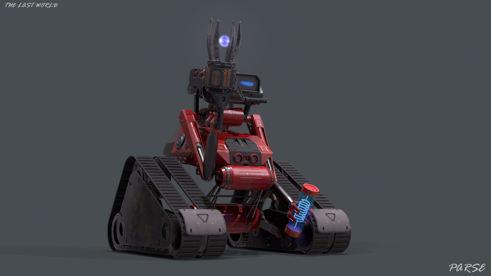
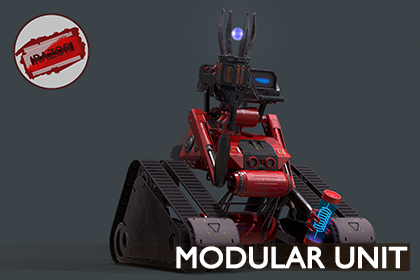
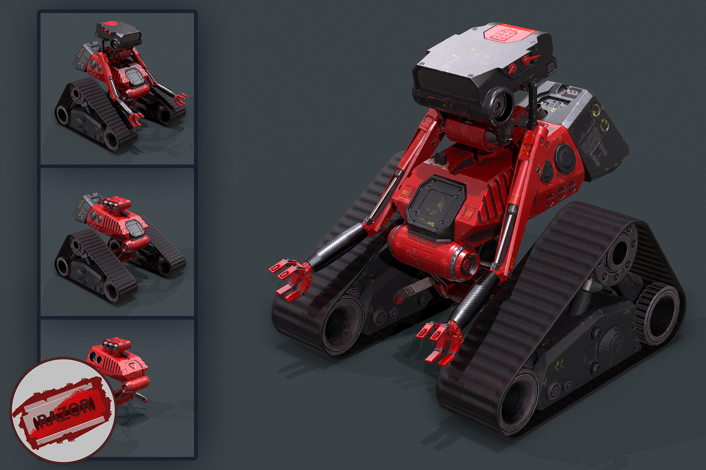
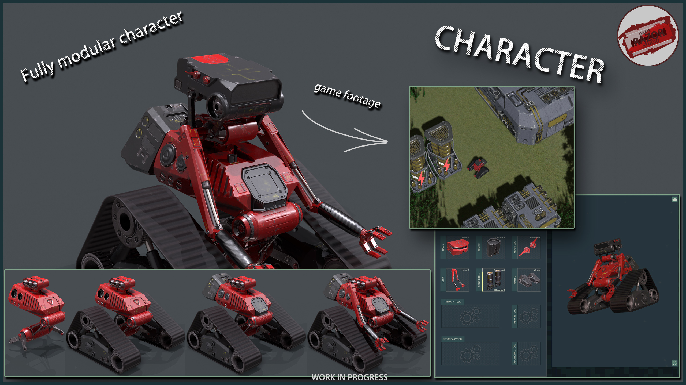
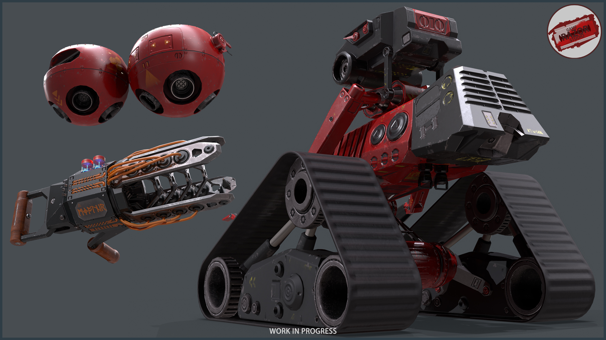

# Support

___

  

> Don't forget to leave feedback! It helps me a lot in development!

# Wall-V Robot Unit

___

Find the asset on Unity [Asset Store](https://u3d.as/3v6d).
If you need the character weapons (or tools) you can find them here: [Factory Game Tools](https://u3d.as/3uU6)
If you need Factory Buildings you can find them here: [Asset Store](https://u3d.as/3uQX)

# About

___

**About:**

High quality, low poly character model in the style of science and the future. The unit model is fully modular and has over 30 detachable parts.
Themes of the unit: future, production, factory, alien technologies, sci-fi, science, robot
You can achieve amazing results using **URP** or **HDRP**. See screenshots from the game!

**Features:**

- 33 attachments
- Each big model has LOD1, which should activate at large distances
- Low-poly: total 55k triangles
- High quality textures (2048x2048, *.png)
- Normal Map, AlbedoTransparency, Emission, MetallicSmoothness
- Ready for animations and game
- Simple animations - idle, walk, mine, no-power
- 40 Icons of each attachment - 1024x1024, *.png
- Modular

> This asset contains character models, textures, materials, icons and simple animations.
> The screenshots showing this asset show what you can achieve. All the footage screenshots showing were taken with using URP

More here: 

# Compatibility

___

 
Compatible with the following versions of **Unity**:
- **Unity 2022.3.7f1** or higher
- **Unity 6000.0.22f1**

Render-pipelines:
- 
- 
- 

# Platform

___

  

# Contacts

___

     

E-mail: choco.16mail@mail.ru
My other [ASSETS](https://assetstore.unity.com/publishers/18484)

# Bug-reports

___

If you find a bug or have any suggestions for improvement, please let us know: choco.16mail@mail.ru

# Refund policy

If you’re uncertain about any asset’s workings or have questions before purchasing, please do not hesitate to reach out. We will do our best to answer your questions. Please read this before purchase to avoid any unwelcome surprises.

This policy attempts to clarify the [asset store EULA‘s](https://unity.com/pt/legal/as-terms) legal jargon and specifies the practical cases that it does, or does not cover. It does not add refund conditions that aren’t already covered by it.

All Asset Store sales **are final** as per the EULA section 2.2.9, which is agreed upon at checkout. Digital purchases cannot be returned once downloaded, hence it’s required to agree to waive the right to a refund. Clicking the “Download” button finalizes this agreement.

This is because it is impossible to ensure the package files are deleted after a refund is issued. Keeping both the package and its monetary value is not a fair trade. Therefore, some conditions must be met in order to avoid abuse or supporting impulsive purchases:
**Conditions that justify a refund:**
- You have not yet downloaded the asset (verified through invoice number).
- Accidental purchase, or on wrong account (only valid if not yet downloaded).
- The asset was removed from the store within 4 weeks of purchasing.
- The asset fails to work as advertised, or there is a vital incompatibility with existing systems (within the confines of the supported platforms, capabilities, and versions). And cannot be resolved in a future update or a hotfix.

**Requests are declined if:**
- The invoice date exceeds 14 days prior to the request.
- You appear to not have read, misread or misunderstood the store page description (“as advertised”), or otherwise failed to inform yourself through the linked online documentation. This includes details such as:
- Minimum/maximum compatible or supported Unity versions
- Compatible or supported platforms
- Scriptable Render Pipeline compatibility (including the built-in RP)
- Listed features and limitations
- The asset is claimed to no longer be used.
- The package in question went on sale, or an upgrade discount was introduced, shortly after a full-price purchase was made.

If you find you are in accordance with these conditions, please get in touch on the basis of your request.

# Updates